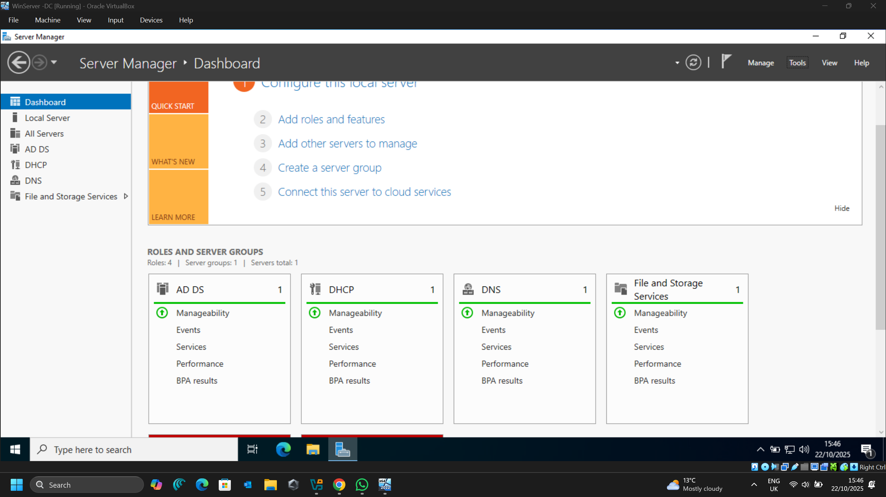
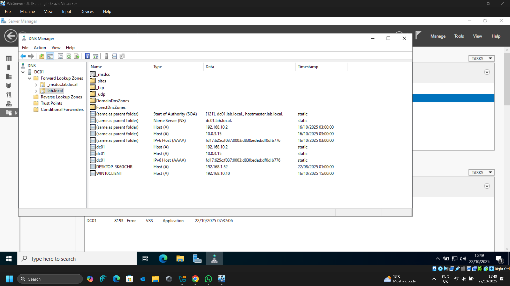
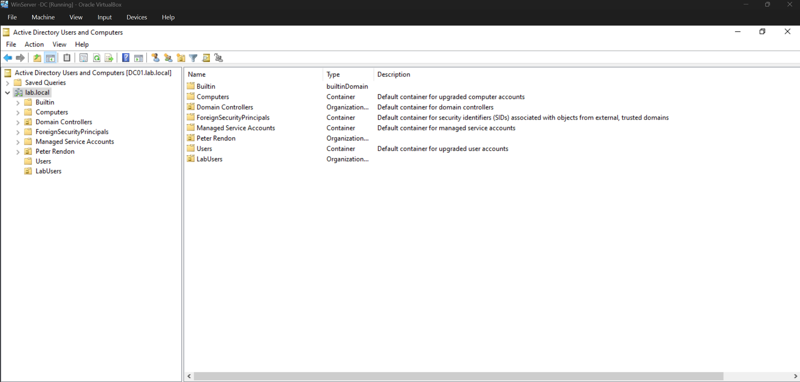
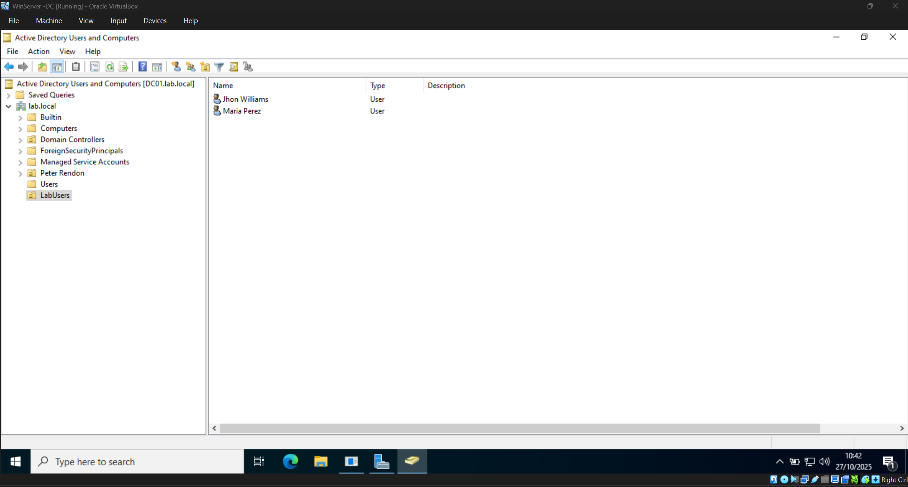
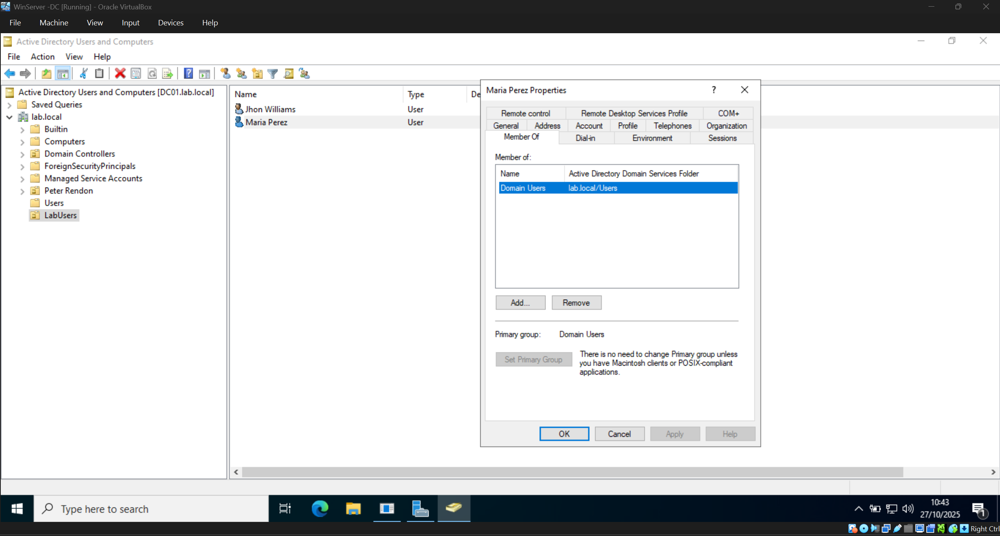
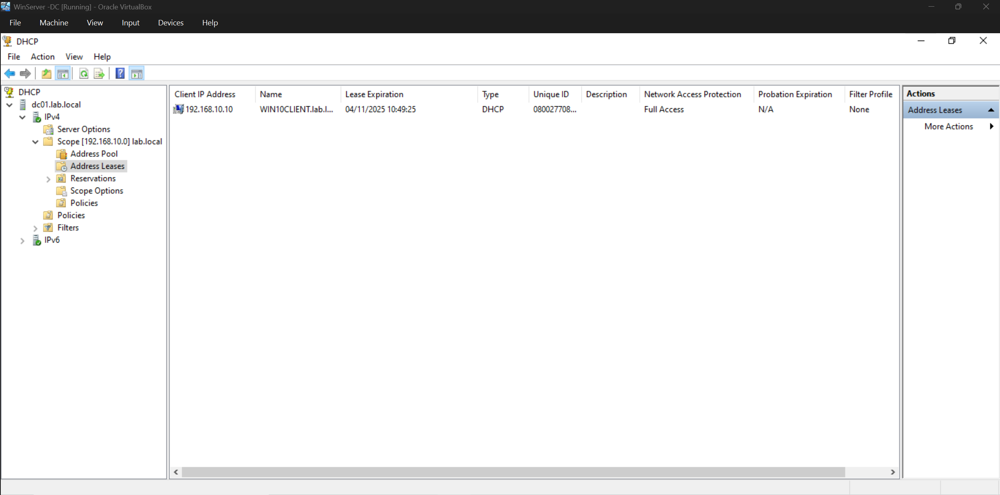
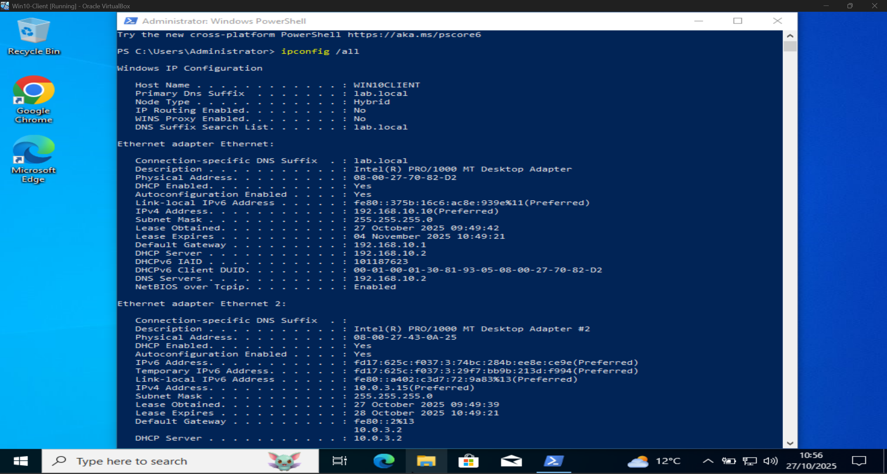
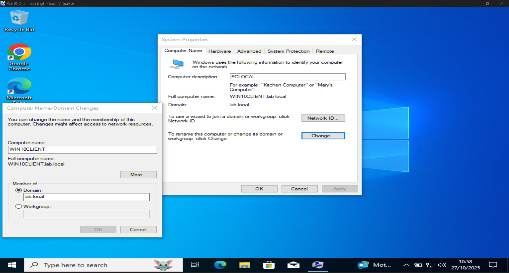
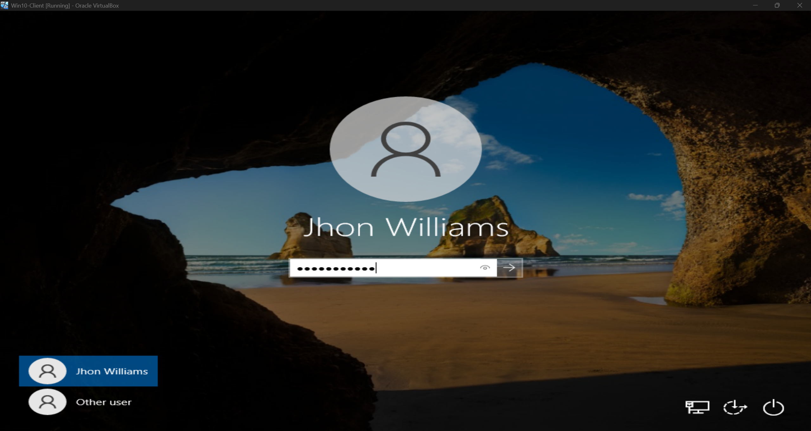
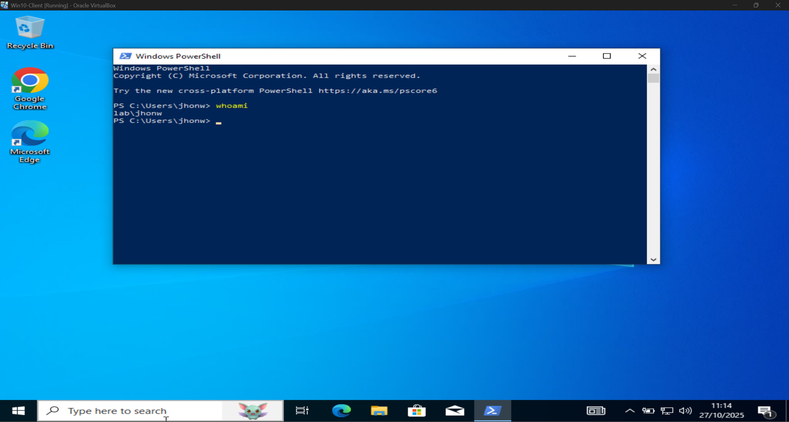

# Active-Directory-Domain-Services-AD-DS-Lab-Windows-Server-2022-Windows-10-Client
A hands-on IT lab demonstrating the setup, configuration, and management of a Windows Server 2022 domain controller integrated with a Windows 10 client. Includes Active Directory, DHCP, DNS, and Group Policy configuration in a simulated enterprise environment.

# 🧩 Active Directory Domain Services (AD DS) Lab  
### Windows Server 2022 & Windows 10 Client Configuration

---

## 📘 Overview
This project simulates a **corporate IT infrastructure** using **Oracle VirtualBox**, where I deployed and configured:
- A **Windows Server 2022** virtual machine acting as a **Domain Controller (DC)**, **DNS**, and **DHCP** server.
- A **Windows 10 Pro client** joined to the **Active Directory domain** `lab.local`.

The lab demonstrates **user management, domain authentication, DHCP IP assignment**, and **Group Policy configuration** — replicating core responsibilities of a **Systems Administrator** or **IT Support Engineer** in a real-world business environment.

---

## 📸 Screenshots

Below are the key screenshots that document each stage of the **Active Directory Domain Services (AD DS)** lab setup and configuration.

| # | Description | Screenshot |
|---|--------------|-------------|
| **1️⃣** | **Server Manager** showing installed roles (**AD DS**, **DNS**, and **DHCP**) on the Windows Server 2022 Domain Controller. |  |
| **2️⃣** | **DNS Manager** confirming the `lab.local` forward lookup zone and domain controller record (`DC01.lab.local`). |  |
| **3️⃣** | **Active Directory Users and Computers (ADUC)** displaying the custom Organizational Unit (OU) named **LabUsers** created under the `lab.local` domain. |  |
| **4️⃣** | Domain user accounts (`john.lab`, `mary.lab`) created inside the **LabUsers** OU. |  |
| **5️⃣** | **User Properties** window in ADUC showing general information and group membership for a domain user. |  |
| **6️⃣** | **DHCP Manager** displaying the **Address Leases** section, confirming that the Windows 10 client received an IP lease (e.g. `192.168.10.10`) from the domain controller. |  |
| **7️⃣** | **Windows 10 Client** network configuration output from `ipconfig /all`, showing IP address, default gateway, and DNS server set to `192.168.10.2`. |  |
| **8️⃣** | **System Properties** on the Windows 10 client confirming successful **domain membership** (`lab.local`). |  |
| **9️⃣** | **Windows 10 login screen** displaying the “Other user” option and domain credentials (`lab\john.lab`) ready to log in to the `lab.local` domain. |  |
| **🔟** | **Command Prompt (whoami)** on the client confirming successful authentication as a domain user (`lab\john.lab`). |  |
| *(Optional)* | Side-by-side view showing **ADUC on the server** and **Command Prompt on the client**, verifying domain connection and authentication in real time. |  |

---

✅ *Each screenshot highlights a critical stage of the domain setup and demonstrates successful connectivity between the Windows Server 2022 Domain Controller and the Windows 10 Pro client.*

---

## ⚙️ Project Setup

### 🖥️ Virtual Machines
| Machine | Role | OS | IP Address | Description |
|----------|------|----|-------------|--------------|
| **DC01** | Domain Controller | Windows Server 2022 | 192.168.10.2 | Hosts AD DS, DNS, and DHCP |
| **Win10-Client** | Domain Workstation | Windows 10 Pro | 192.168.10.10 | Joined to lab.local domain |

---

## 🧠 Technical Objectives
- Deploy and configure **Active Directory Domain Services (AD DS)**.
- Set up and verify **DNS** and **DHCP** roles.
- Create **Organizational Units (OUs)** and **Domain Users**.
- Join a **Windows 10** workstation to the domain.
- Authenticate users via **Active Directory**.
- Prepare for **Group Policy Management (GPO)**.

---

## 🧰 Skills Demonstrated
- Windows Server 2022 Administration  
- Active Directory Configuration  
- DNS and DHCP Management  
- Organisational Unit (OU) Structuring  
- Domain User and Group Creation  
- Group Policy Management (GPO)  
- Virtual Networking (Oracle VirtualBox)  
- Command Line & Troubleshooting  

---

## 🧩 Configuration Steps

### 1️⃣ Install and Configure Active Directory (AD DS)
- Promoted Windows Server 2022 to a **Domain Controller**.
- Created domain: `lab.local`.
- Installed supporting roles:
  - **DNS Server**
  - **DHCP Server**

### 2️⃣ Configure DHCP
- Defined DHCP scope: `192.168.10.0/24`.
- Assigned default gateway and DNS options.
- Verified client IP assignment through **Address Leases**.

### 3️⃣ Create Organisational Unit (OU)
- Created **OU: LabUsers** inside `lab.local`.
- Protected the OU from accidental deletion.

### 4️⃣ Create Domain Users
- Added domain users inside `LabUsers` OU:
  - `john.lab`
  - `mary.lab`
- Assigned secure test passwords.
- Verified group membership and domain authentication.

### 5️⃣ Join Windows 10 Client to Domain
- Joined workstation to `lab.local`.
- Rebooted and logged in using domain credentials:
